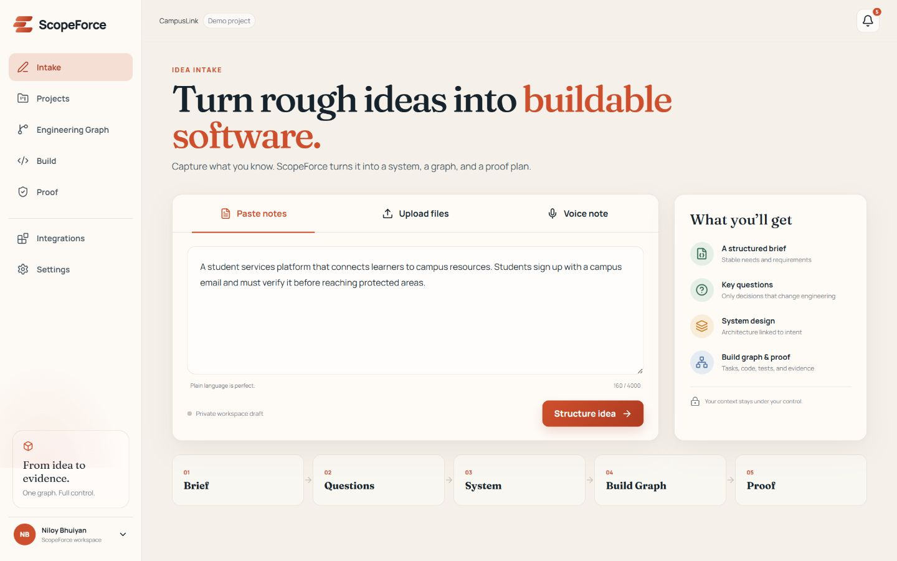
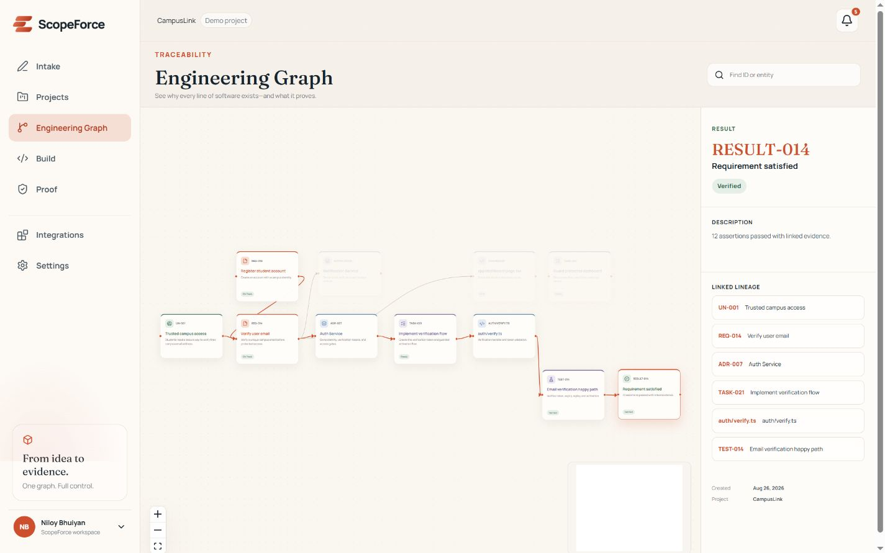
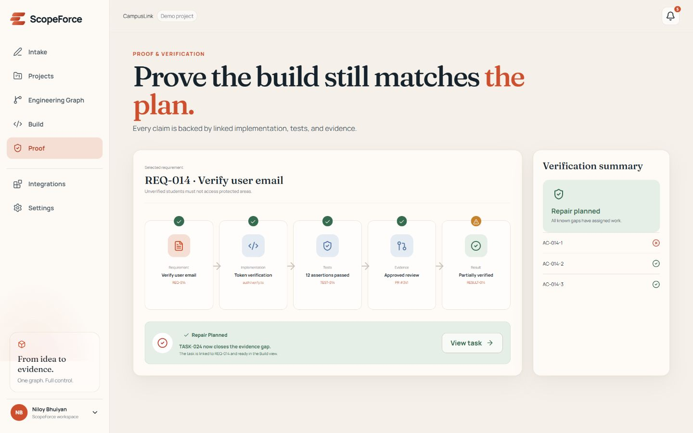

# ScopeForce

ScopeForce is the engineering control plane between a software idea and AI-built production software. It converts rough context into a persistent Engineering Graph that connects user needs, requirements, architecture, tasks, code, tests, evidence, and results.

The CampusLink MVP demonstrates the complete product loop: intake, grounded clarification, structured scope, system design, graph traceability, controlled build simulation, collision handling, proof, drift repair, blast-radius planning, provider boundaries, and an exportable handoff.

## Live release

- Production: [scopeforce.vercel.app](https://scopeforce.vercel.app)
- Source: [github.com/Niloy-Bhuiyan/ScopeForce](https://github.com/Niloy-Bhuiyan/ScopeForce) (private)

The production deployment uses deterministic local embeddings and grounded fallback responses until `OPENAI_API_KEY` is configured. Its vector index is in-memory and ephemeral by design for the MVP.

## Product tour

| Turn an idea into structure | Trace intent to evidence |
| --- | --- |
|  |  |



## The startup problem

AI can produce software quickly, but a team still needs to know why each change exists, which decisions shaped it, whether parallel work collides, and what evidence proves the result. ScopeForce keeps those answers in one canonical Engineering Graph instead of scattering them across prompts, tickets, diagrams, and test output.

The CampusLink flow turns an idea into a connected sequence:

```text
need → requirement → architecture → task → code → test → result
```

The same graph powers four views: engineering traceability, deterministic build planning, verification and drift repair, and change-impact analysis. Stable source identifiers such as `REQ-014`, `TASK-021`, and `TEST-014` remain consistent across every view and exported handoff.

## Controlled build, proof, and change impact

- Build orchestration applies deterministic dependency and module-collision rules. The UI clearly labels provider execution as simulated.
- Proof links acceptance criteria to implementation, tests, review evidence, and results. A drift example can create a real graph repair task.
- Blast Radius traverses graph relationships to summarize affected services, data, APIs, tests, and estimated rework, then creates an impact-plan task.
- Handoff exports the project brief, graph, build state, proof, and provider boundaries as structured JSON.

## Project Context Intelligence

The Python service implements a real grounded RAG vertical slice:

1. FastAPI validates text or file-derived context and assigns stable source IDs.
2. LangChain splits documents into source-preserving chunks.
3. The embedding adapter uses OpenAI embeddings when configured, or deterministic local hash vectors otherwise.
4. Similarity retrieval applies a relevance threshold and returns citations.
5. LangChain prompt templates constrain clarification and requirement generation to retrieved context.
6. The OpenAI adapter requests structured output when configured; validated deterministic responses keep the no-key demo functional and honest.

No-context, provider-failure, malformed-output, chunking, retrieval, citation, and grounding behavior are covered by Python tests. See [AI RAG architecture](docs/AI_RAG_ARCHITECTURE.md) for the trust boundary and persistence details.

## What is real

- Responsive Next.js product with shared application state and interactive React Flow graph lenses.
- Deterministic lineage, collision, build-state, drift-repair, and blast-radius logic.
- File/text intake, browser voice recording where supported, notifications, and structured JSON export.
- FastAPI endpoints for ingestion, retrieval, clarification, and requirements.
- LangChain document chunking, prompt composition, OpenAI structured output, OpenAI embeddings, and similarity retrieval when `OPENAI_API_KEY` is configured.
- Deterministic local embeddings and grounded responses when no provider is configured; these are labelled demo mode.

## What is simulated or planned

Coding-provider execution and build progress are deterministic simulations; no claim is made that Codex, Claude, Gemini, or Grok executed code. The deployed in-memory vector index is ephemeral. Durable multi-tenant persistence, repository-wide continuous verification, and live provider orchestration are planned.

## Stack

Next.js 16, React 19, TypeScript, React Flow, Motion, Zustand, Zod, FastAPI, Pydantic, LangChain, `langchain-openai`, and a vector-store adapter with OpenAI or local hash embeddings.

## Architecture

One repository deploys as one Vercel project:

```text
Browser
  ├─ Next.js product UI       app/ + components/
  ├─ deterministic domain     lib/domain/
  └─ shared client state      lib/store/
             │
             └─ /api/ai/*
                    │
                    ├─ FastAPI entrypoint       api/index.py
                    ├─ LangChain RAG            ai/rag.py + ai/prompts.py
                    ├─ provider adapters        ai/providers.py
                    └─ vector-store boundary    ai/vector_store.py
```

Next.js owns product routes while Vercel rewrites `/api/ai/*` to the FastAPI function. The HTTP layer depends on provider and vector-store interfaces, allowing the current ephemeral adapter to be replaced without changing the route contract. See [system architecture](docs/ARCHITECTURE.md), [Engineering Graph](docs/ENGINEERING_GRAPH.md), and [data model](docs/DATA_MODEL.md).

## Run locally

```bash
npm install
npm run dev
```

For the combined UI and Python API, install Python dependencies and use Vercel CLI:

```bash
python -m venv .venv
.venv/Scripts/python -m pip install -e ".[test]"
npx vercel dev
```

Copy `.env.example` to `.env.local` only when using a live provider. Never commit it. Without a key, ingestion and retrieval remain functional with deterministic local embeddings.

### Environment variables

| Variable | Required | Purpose |
| --- | --- | --- |
| `OPENAI_API_KEY` | No | Enables live OpenAI embeddings and structured grounded generation. |
| `OPENAI_MODEL` | No | Generation model; defaults to `gpt-4.1-mini`. |
| `OPENAI_EMBEDDING_MODEL` | No | Embedding model; defaults to `text-embedding-3-small`. |

## Quality gates

```bash
npm run lint
npm run typecheck
npm run test
npm run build
.venv/Scripts/python -m pytest
.venv/Scripts/python -m ruff check api tests/python
```

## API

- `GET /api/ai/health`
- `POST /api/ai/ingest`
- `POST /api/ai/retrieve`
- `POST /api/ai/clarify`
- `POST /api/ai/requirements`

## Deployment

The repository is linked to Vercel. Pushes to `main` create production deployments; local combined-runtime testing uses `npx vercel dev`. Configure secrets through Vercel environment settings, never through committed files. The health route reports the active AI, embedding, and vector-store modes so fallback behavior is observable.

## Roadmap

- Durable tenant-scoped document and vector persistence.
- Real authentication, workspace isolation, roles, retention, and audit logs.
- GitHub repository ingestion and evidence synchronization.
- Live coding-provider adapters with approval gates and sandboxing.
- Continuous repository/CI drift detection and collaborative graph change review.

See [product documentation](docs/PRODUCT.md), [security](docs/SECURITY.md), [test strategy](docs/TEST_STRATEGY.md), the full [roadmap](docs/ROADMAP.md), and [build state](docs/BUILD_STATE.md).
